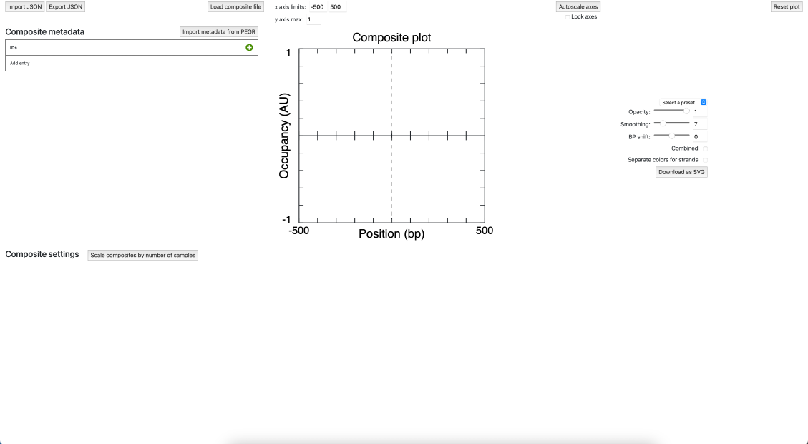

# Plotter
Plotter is a web application made for plotting epigenomic data.

## Getting started
Open index.html in a web browser (mostly tested in Safari).

Click "Add entry" in the Composite metadata table to initialize a composite.

Load composite files into the Composite settings table to plot.

If you load multiple files to a single composite, the resulting plot will be the sum of the components.

### Data format
Loaded composite files should be the format of the composite output of [ScriptManager](github.com/CEGRcode/scriptmanager)'s tag pileup tool.
The file name should start with the sample identifier, followed by an underscore.

## Features

### Plotting parameters
Plotter allows you to change the following parameters:
* axis limits (top of the page)
* plot labels (click on the label and type; press enter to confirm)
* plot colors (click on the color box in the Composite settings table)
* legend labels (click on the name in the Composite settings table and type)
* global opacity, smoothing (moving average window size), and 3' base pair shift (right)
* composite scaling factor (Composite settings table)
* individual composite opacity, smoothing, and 3' base pair shift (overrides global unless blank) (Composite settings table)
* hide composite (Composite settings table)
* composite order on plot (drag rows on Composite settings table to change the order; top row corresponds to the top layer on the plot)
* combined strands (do not count forward and reverse strands separately) (right)
* separate colors for forward and reverse strands (mutually exclusive with combined strands) (right)
* preset settings based on prior work (right)

### Metadata table
The metadata table allows the user to keep track of the metadata for each composite. This table is linked to the Composite settings table.
* Click "Add entry" to add a new composite (adds a new row to the Composite metadata table and to the Composite settings table and initializes a composite on the plot).
* Click a red "x" button to remove the corresponding composite (deletes the corresponding row on the Composite metadata table and Composite settings table and removes the composite from the plot).
* Hover over the green "+" graphic to show which columns to toggle.
  * Click a column name in the dropdown to toggle the column.
  * Click +Custom Field to add a custom column.
  * All fields except the IDs field are editable.
* If the sample identifiers are PEGR IDs, you can import metadata from PEGR. Clicking the Import metadata from PEGR button opens an input box for your PEGR API key and your PEGR user email. Submit to autofill the metadata table (cells with mismatches between PEGR IDs will be highlighted red).

### Save SVG graphic
To save a plot as an SVG graphic, click "Download as SVG" to the right of the plot.

### Saved sessions
Plotter can save and load sessions. This allows you to save your work and come back to it later.
To save a session, click "Export JSON" near the top left of the page.
To load a session, click "Import JSON" near the top left of the page and select a JSON file.

## Notes
Standard parameters (meant to emulate Mittal et al. 2022):
* Tag pileup run on 1100 bp windows (to allow data at the x-axis limits to be plotted)
* x-axis limits: -500 to 500
* 100% opacity
* 30 bp sliding window for smoothing
* 0 bp shift
* Lines from composite annotations to plots are 0.5 pixels wide
* Annotation color for yellow (#D7D700) to increase contrast: #AAA200
* Annotation color for off-white (#EBEBEB) to increase contrast: #858585