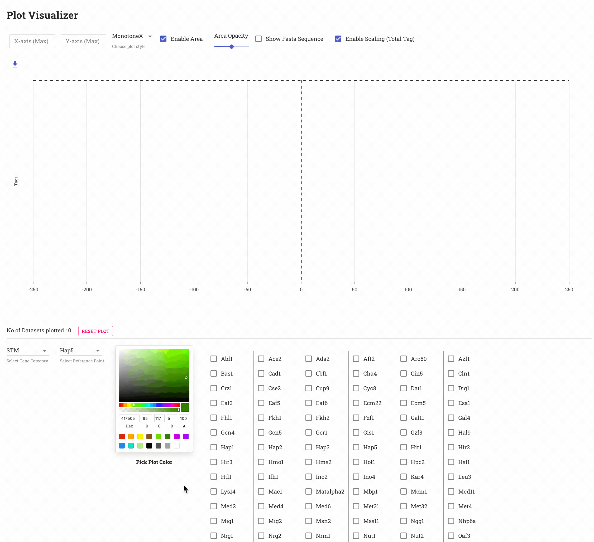

# plotter

Visualization tool to plot composites at reference points &amp; regions of interest

---

#### Generating data for the app

The `utils` directory contains :

| Script                   | Description                                                                            |
| ------------------------ | -------------------------------------------------------------------------------------- |
| `createFastaData.py`     | creates a `POST`able JSON file from csv file with nucleotide values                    |
| `generateJson.py`        | creates an `intermediate` JSON file from csv file with Composite values                |
| `appendScalingFactor.py` | adds scaling factors to the `intermediate` JSON and generate the final `POST`able JSON |

**Input data format and script usage**

| Script                   | Usage example                                                                                     |
| ------------------------ | ------------------------------------------------------------------------------------------------- |
| `createFastaData.py`     | `python createFastaData.py sampleData/rawFasta.csv`                                               |
| `generateJson.py`        | `python generateJson.py sampleData/rawComposite.csv > sampleData/exampleComposite.json`           |
| `appendScalingFactor.py` | `python appendScalingFactor.py sampleData/scalingFactors_tt.csv sampleData/exampleComposite.json` |
