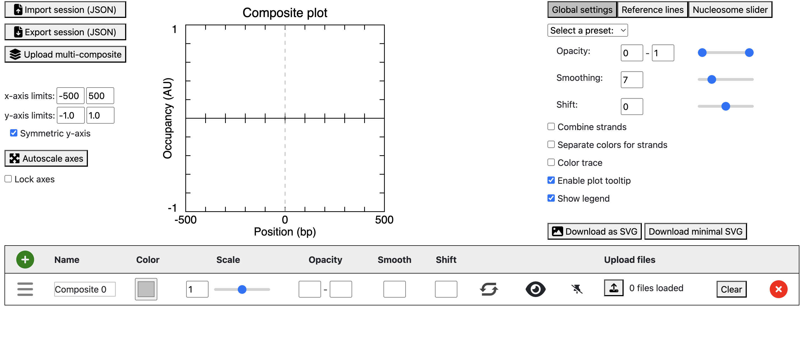
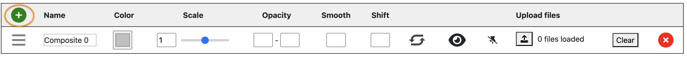

Welcome to Plotter! 

Plotter is a web application made for plotting genomic data. 

# Getting Started 
1. Download the repository labeled “plotter” from [CEGRcode Github](https://github.com/CEGRcode)
2. Open **“plotter”** from your device’s local directory.
3. Right-click the **"index.html"** file to open with your device’s home browser.
4. The locus plotter interface should now be displayed on your screen through your device’s home browser. 

  

## Important Features 
**Import/Export JSON session**: Allows users to save their current JSON session (export) and import it at a later date to start where they left off.

**Upload Multi-Composite**: Allows users to upload a more complex multi-composite.

**Autoscale axes**: Allows the system to automatically scale the axes of the plot.

**Lock axes**: Locks the current axes inputs so that they are not changeable. 

### Global Settings Features
- **Opacity**: Controls the transparency of plotted elements (e.g., composite plots, reference lines).
- **Smoothing**: Applies a smoothing function to reduce noise in plotted genomic data.
- **Shift**: Adjusts the alignment of plotted data by shifting values along the x-axis (genomic positions).
- **Combine Strands**: Merges data from both sense (+) and antisense (-) strands into a single composite plot.
- **Color Trace**: Color-codes plotted traces
- **Enable Plot Tooltip**: Enables tooltips that display data values when hovering over the plot.
- **Show Legend**: Displays plot legend, which identifies different plotted elements. 
- **Download as SVG**: Allows users to export the plot as an SVG (Scalable Vector Graphics) file. 

### Reference Lines Features
Reference lines are used to highlight specific genomic positions or values for better visualization and interpretation of data.
- **Horizontal Lines**: Draws a horizontal reference line at a specified y-axis value (occupancy). 
- **Vertical Lines**: Draws a vertical reference line at a specified x-axis position (genomic position).

### Nucleosome Slider**
These features help analyze nucleosome positioning and dynamics in genomic data.
- **Nucleosome Position**: Allows users to shift nucleosome data to correct for reference alignment or compare nucleosome shifts under different conditions.
- **Mark Position in Nucleosome Slider**: Adds a marker at a specific nucleosome position within the slider interface. 
- **General 3D Visual**: Enables a three-dimensional (3D) visualization of nucleosome positioning and occupancy. 

# Creating a Plot
1.  Download the provided data to your device. To generate your own data, check out this [tutorial](https://github.com/CEGRcode/scriptmanager-docs/blob/main/docs/Tutorials/chipexo-tutorial.md)

    * Loaded composite files should be the format of the composite    output of ScriptManager's tag pileup tool. The file name should start with the sample identifier, followed by an underscore ("_composite.out"). 

2. Initialize a composite via the "Add Entry" Section.

  

    * For each "_composite.out file", make a different entry. 

3. Upload a Composite file into each entry section.

  

    * Uploading multiple files to a single composite results in a new composite that is the sum of the components.

  

    
  

4. Rename the title and axes to reflect your desired plot. Simply click on the axes to rename, and press enter when done.

  

5. Adjust features in Global Settings, Reference Lines, and Nucleosome Slider  if Needed. 

  

