# Quick start
1. Download the repository labeled “plotter” from [CEGRcode Github](https://github.com/CEGRcode)
2. Open “plotter” from your device’s local directory.
3. Right-click the index.html file to open with your device’s home browser.
4. The locus plotter interface should now be displayed on your screen through your device’s home browser.
5. Download the provided data to your device and import it onto the interface
To generate your own data, check out this [tutorial](https://github.com/CEGRcode/scriptmanager-docs/blob/main/docs/Tutorials/chipexo-tutorial.md)

# Important Buttons
- Import/Export JSON session: allows users to save their current JSON session (export) and import it at a later date to start where they left off
- Reset Plot: allows users to reset the plot, outputting an empty plot
- Select a preset: allows users to apply a preset of already-customized inputs to their plot
- Autoscale axes: allows the system to automatically scale the axes of the plot
- Lock axes: locks the current axes inputs so that they are not changeable 

# Tutorial
1. Click “add entry” to create a new row under IDs
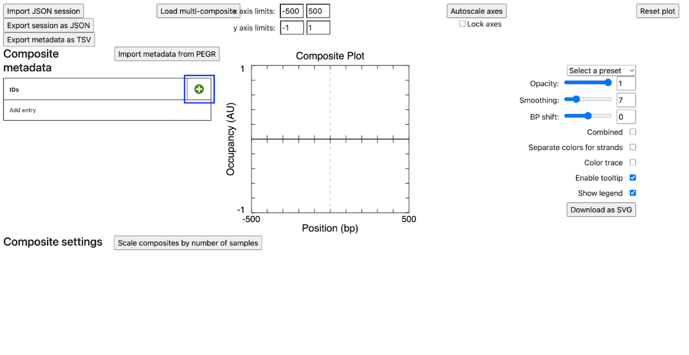
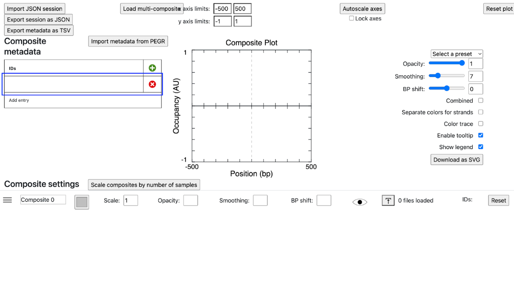
2. Locate the composite files generated from the previous section. Drag and drop each file into their corresponding row. In this session, the files will be sectioned according to their read number.
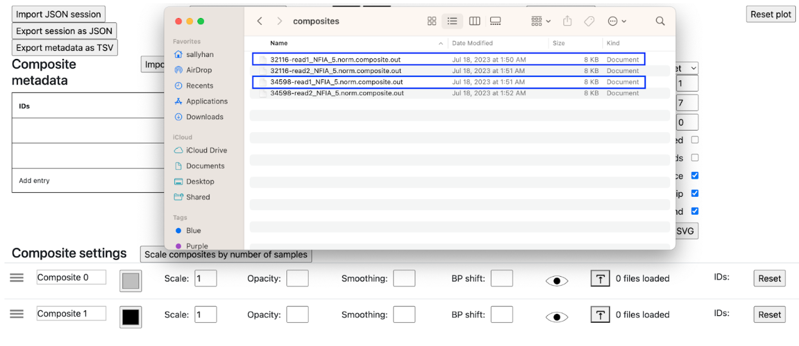
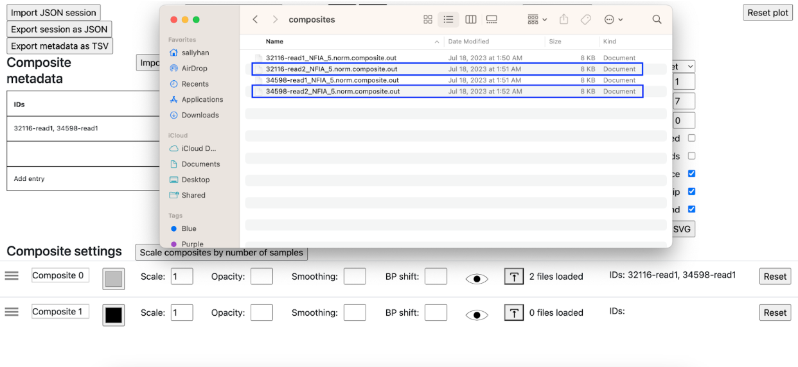
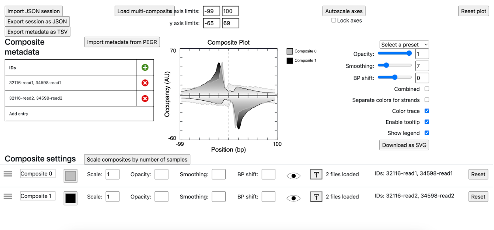
3. Rename “Composite 0” to “Read 1”, and respectfully for the other section. Changes should be reflected in the legend on the right of the Composite plot.
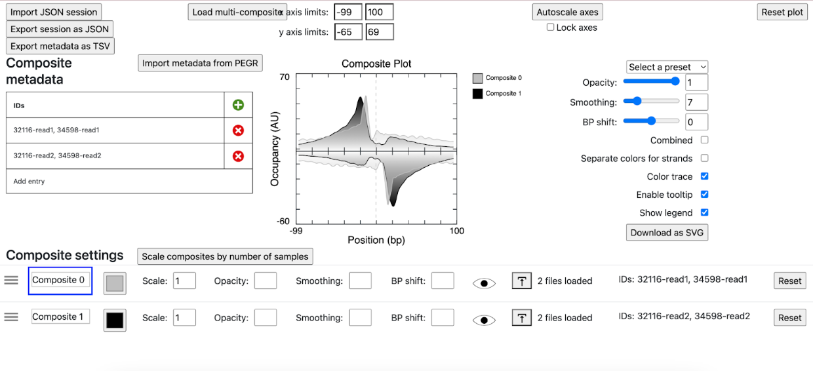
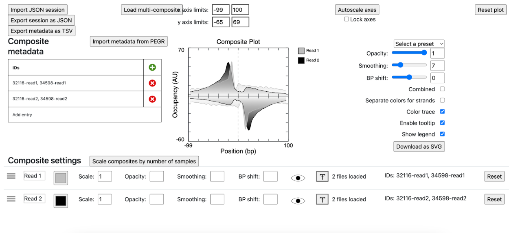
5. Check off the checkbox “Separate colors for strands.” Change colors for each of the file names so that each file is a different color in the plot. After choosing colors in the wheel, press “enter” on your keyboard to save the changes.
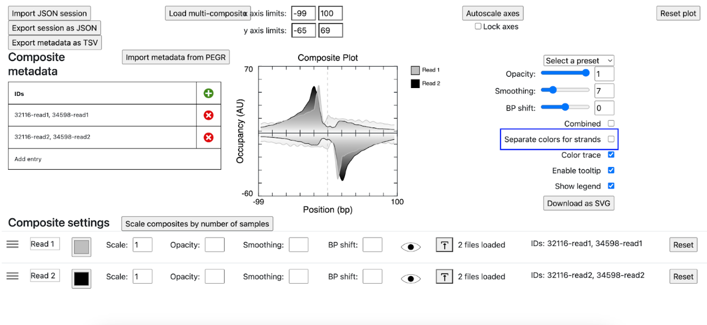
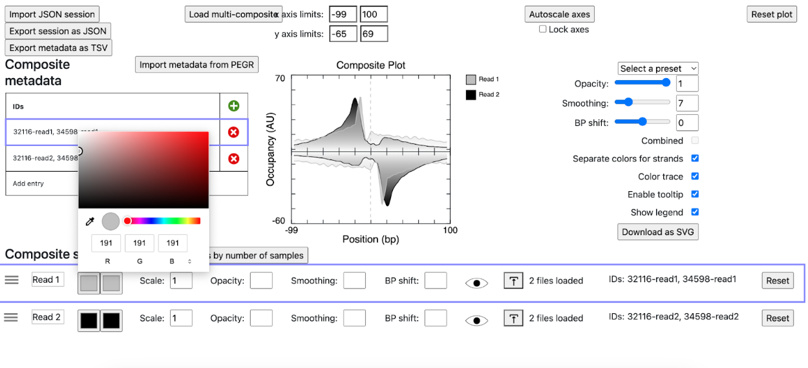
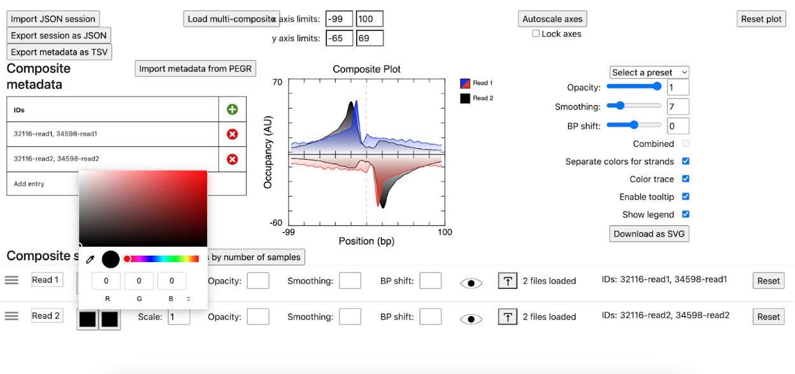

7. Play around with the plot to your desire. In this session, smoothing was changed to 1, and thus the y axis limits changed to achieve a more zoomed-out look.

8. Rename the title and axes to reflect your desired plot. Simply click on the axes to rename, and press enter when done.
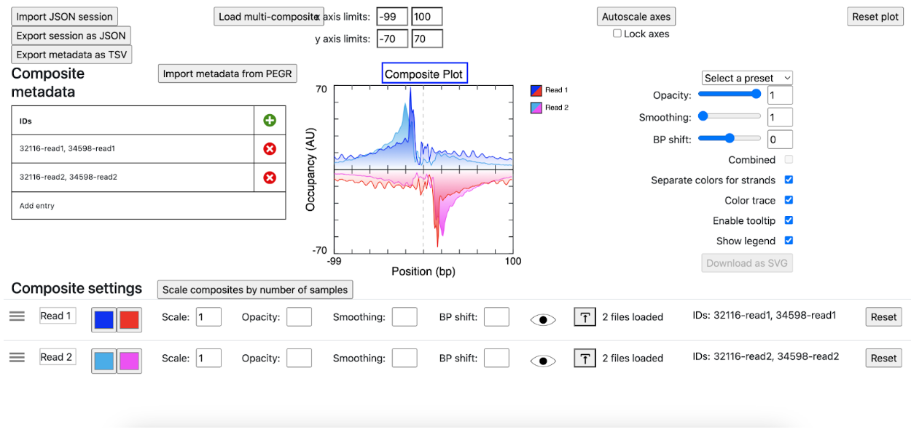
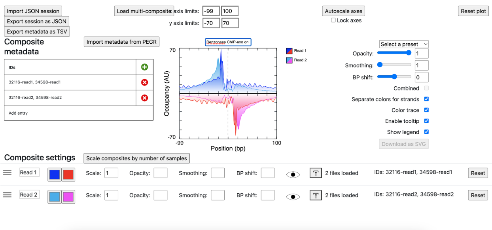
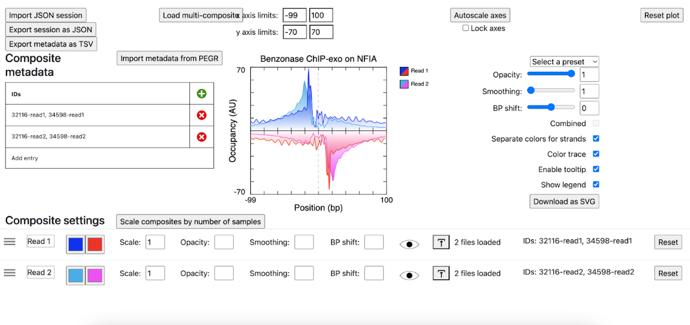
10. Once completed, download your plot as an SVG
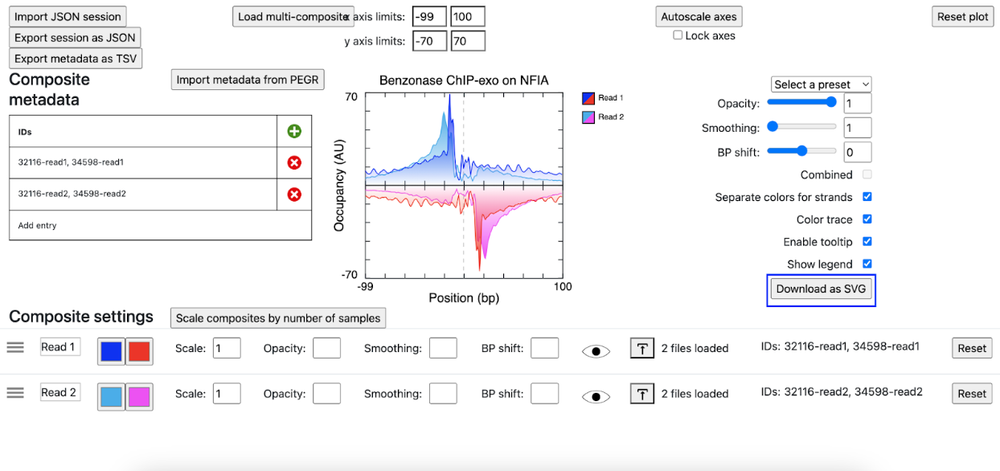   
